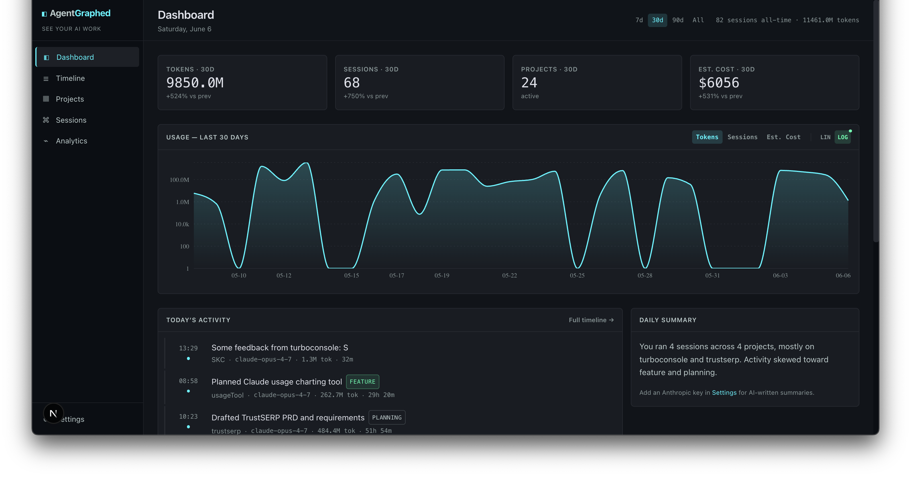
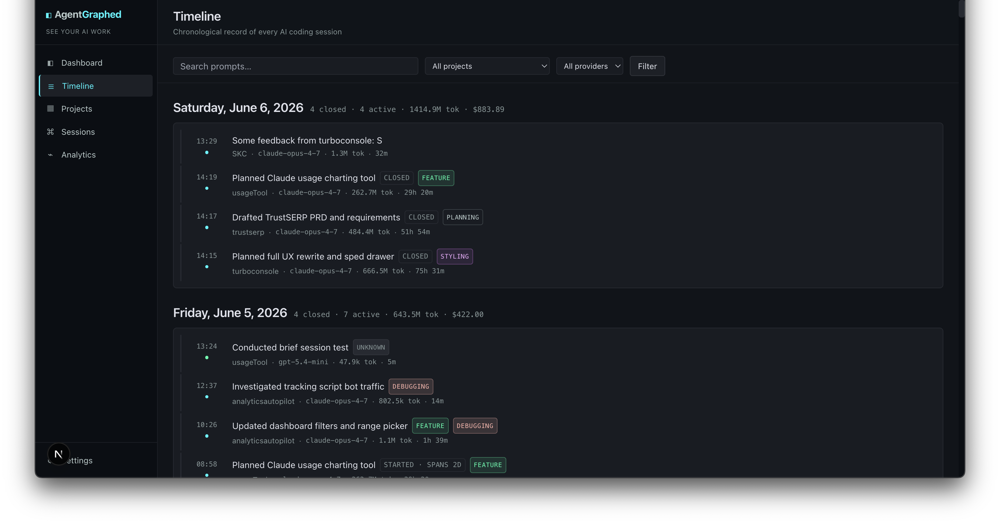
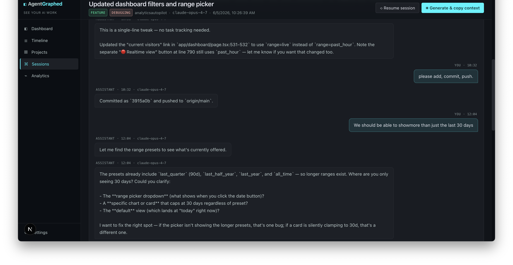
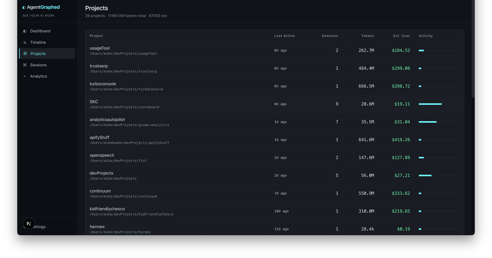
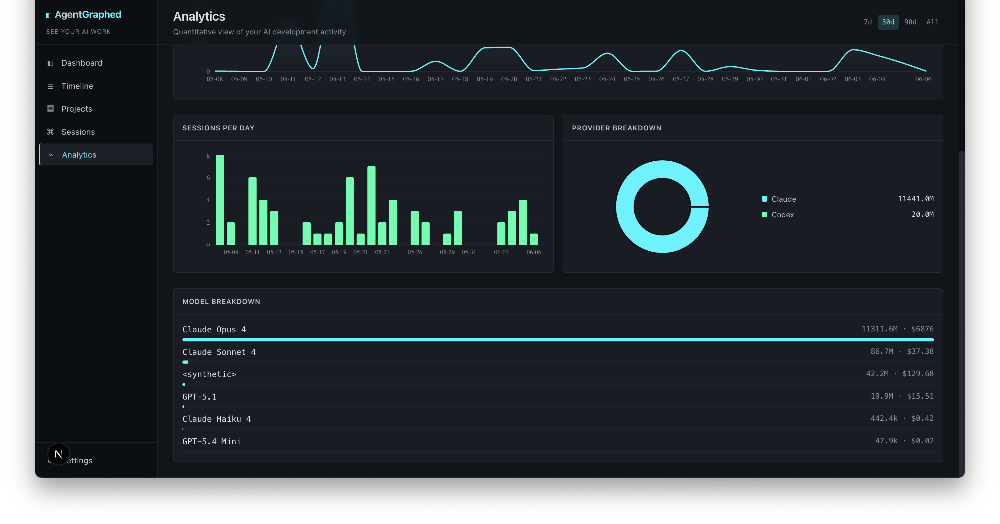

<div align="center">

# AgentGraphed

**Local-first analytics dashboard for AI coding sessions.**

See what you built with Claude Code and Codex CLI — across every project, every session, every dollar.

[](https://www.npmjs.com/package/agentgraphed)
[](./LICENSE)
[](https://nodejs.org)

</div>



---

## Why

You've been pair-coding with AI for months. Where did all those sessions go? Which projects ate your week? How much have you spent? AgentGraphed reads your local Claude Code and Codex CLI logs and turns them into a real dashboard — timelines, project breakdowns, model usage, cost estimates, and one-click resume.

No login. No cloud. Nothing leaves your machine.

## Install

```bash
npx agentgraphed
```

That's the whole install command — there's nothing to clone, configure, or sign into. On first run, npm downloads the package (~15 MB) and the dashboard opens at <http://localhost:3737>. Re-run any time to refresh; npm caches the package after the first install, so subsequent runs start in seconds.

> **First run takes 30–60 seconds** while npm downloads. You'll see a `npm warn exec` line and a few `npm warn deprecated` warnings from transitive dependencies — those are harmless and will get cleaned up in a future release. Once you see `› Ready. Press Ctrl+C to stop.` in your terminal, the dashboard is live.
>
> **Requires Node 20+.** Check yours with `node --version`. If you don't have Node, [download it here](https://nodejs.org/) (the LTS version is fine).
>
> **Prefer a global install?** `npm install -g agentgraphed && agentgraphed` works too.

## Using AgentGraphed

After `npx agentgraphed`, the dashboard opens automatically. From there:

- **Browse your work** — Timeline groups every session by day. Click any session to read the full conversation in a chat-bubble view.
- **Resume a session** — On any session page, click *Resume session* to copy `cd <cwd> && claude --resume <id>` to your clipboard. Paste it in your terminal to pick up where you left off in Claude Code.
- **Find a specific project** — Projects ranks every git repo by activity. Click one to see only that repo's sessions.
- **Refresh after more coding** — Re-run `npx agentgraphed`. It re-scans your CLI logs and indexes anything new in seconds; already-ingested sessions are skipped.
- **Get clean titles and categories** *(optional)* — Open *Settings → LLM provider*, paste an Anthropic or OpenAI key, then click *Classify uncategorized*. Past-tense titles like "Fixed Stripe checkout bug" replace the raw first prompt.
- **Stop** — Hit `Ctrl+C` in the terminal that's running it. Your data stays in `~/.agentgraphed/` for next time.

## Features

- **Dashboard** — 30-day usage chart, KPIs, top projects, work categories at a glance
- **Timeline** — every session grouped by day, searchable, filterable by project or provider
- **Projects** — auto-detected from git repo roots; see which projects pull the most AI time
- **Sessions** — read past conversations in a clean chat-bubble view
- **Resume** — one click copies `cd <cwd> && claude --resume <id>` to your clipboard
- **Copy context** *(optional, BYO LLM key)* — generates a primer for a fresh chat
- **Multi-label classification** *(optional, BYO LLM key)* — auto-categorizes sessions as Feature / Debugging / Planning / Refactor / Styling / DevOps / Data / Payments / Docs / Content
- **Cost estimates** — uses LiteLLM's auto-updating pricing data (2700+ models covered)
- **Range picker** — 7d / 30d / 90d / all-time on every chart

## Screenshots

<table>
  <tr>
    <td width="50%">
      <a href="./docs/screenshots/timeline.png"></a>
      <p align="center"><sub><b>Timeline</b> — every session, grouped by day. Multi-day sessions get <code>STARTED · SPANS Nd</code> / <code>CONTINUED</code> / <code>CLOSED</code> badges so nothing hides on one bucket.</sub></p>
    </td>
    <td width="50%">
      <a href="./docs/screenshots/session-detail.png"></a>
      <p align="center"><sub><b>Session detail</b> — read past conversations in a clean chat-bubble view. One click to resume in Claude Code or copy a primer for a fresh chat.</sub></p>
    </td>
  </tr>
  <tr>
    <td width="50%">
      <a href="./docs/screenshots/projects.png"></a>
      <p align="center"><sub><b>Projects</b> — every git repo you've worked in, ranked by activity. See which projects are eating your week.</sub></p>
    </td>
    <td width="50%">
      <a href="./docs/screenshots/analytics.png"></a>
      <p align="center"><sub><b>Analytics</b> — sessions per day, provider split, model breakdown with cost per model.</sub></p>
    </td>
  </tr>
</table>

## Privacy

- Everything lives in `~/.agentgraphed/agentgraphed.sqlite` on your machine.
- Nothing is uploaded unless **you** click "Copy context" or "Classify sessions," and even then only to *your* LLM provider with *your* API key.
- API keys are stored in plaintext in the SQLite file — same threat model as `~/.aws/credentials` or a `.env`. Don't commit your home folder to git.

## Supported sources

- **Claude Code** — reads `~/.claude/projects/*/*.jsonl`
- **Codex CLI** — reads `~/.codex/sessions/YYYY/MM/DD/*.jsonl`

More adapters coming. If you want a specific one, [open an issue](https://github.com/sudomichael/agentgraphed/issues/new).

## Optional: LLM session titles & categories

Without an API key, sessions show the first line of the first prompt as the title. With a key:

- **Anthropic** — Haiku 4.5 (default) gives clean past-tense titles like "Fixed Stripe checkout double-decimal bug"
- **OpenAI** — GPT-5 mini works equally well, often cheaper

Click *Settings → LLM provider*, paste your key, then *Classify uncategorized*. Cost is fractions of a cent per session — typically $0.01–0.03 for a few hundred sessions.

## Configuration

Environment variables:

| Variable                  | Default                                   | What it does                                   |
| ------------------------- | ----------------------------------------- | ---------------------------------------------- |
| `AGENTGRAPHED_PORT`       | `3737`                                    | Starting port (auto-increments if in use)      |
| `AGENTGRAPHED_DATA_DIR`   | `~/.agentgraphed`                         | Where to store the SQLite DB                   |
| `AGENTGRAPHED_CLAUDE_DIR` | `~/.claude/projects`                      | Override Claude Code log location              |
| `AGENTGRAPHED_CODEX_DIR`  | `~/.codex/sessions`                       | Override Codex log location                    |

Log directories can also be edited at `Settings → Data sources` without restarting.

## Development

```bash
git clone https://github.com/sudomichael/agentgraphed.git
cd agentgraphed
npm install
npm run dev
```

Open `http://localhost:3737`. Hot reload, source under `src/`.

To produce a publishable build:

```bash
npm run build         # builds Next.js standalone bundle
npm pack              # creates agentgraphed-X.Y.Z.tgz
```

## License

MIT © [Michael Patrick](https://github.com/sudomichael)
